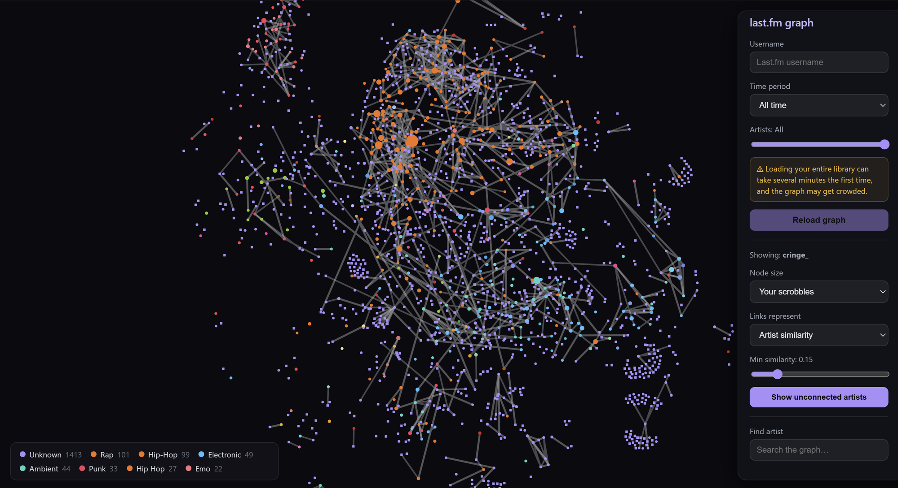

# Constellation.fm

An Obsidian-graph-view-style map of your Last.fm listening history. Type a
username and your library becomes an interactive force-directed universe:
every node is an artist you've listened to, sized by how much you play them,
linked to the artists Last.fm considers similar, and colored by genre.



## Features

### The graph

- **Nodes are artists** from your Last.fm listening history — anywhere from
  your top 20 to your entire library (thousands of artists).
- **Node size** is configurable:
  - *Your scrobbles* — how many times you've played the artist (default)
  - *Global listeners* — worldwide Last.fm listener count (mainstream vs. niche)
  - *Connection count* — how many links the artist has in your graph (finds
    the "hub" artists that tie your taste together)
  - *Global playcount* — worldwide total plays
- **Links are configurable** too:
  - *Artist similarity* — Last.fm's similarity score between the two artists;
    stronger matches draw thicker, brighter lines. A **min similarity** slider
    hides weak links to declutter dense graphs.
  - *Shared genre tags* — artists link when they share top tags (e.g. both
    tagged "shoegaze"), with a min-shared-tags slider.
- **Node color = dominant genre tag** (rock, electronic, hip-hop, ambient…),
  so genre neighborhoods are visible at a glance. A legend in the corner
  counts the top genres in view.

### Interactions

- **Hover** an artist to spotlight it and its direct connections, dimming
  everything else — just like Obsidian's graph view.
- **Click** an artist for a details panel: your scrobbles, global listeners
  and plays, connection count, genre tags, and a link to their Last.fm page.
- **Search** the graph by artist name and the camera flies to the match.
- **Hide unconnected artists** with one button to trim isolated nodes (it
  respects your current link settings, and toggling back restores them in
  place).
- **Drag, pan, and zoom** freely. Dragging is disabled above 1,000 artists,
  where it would bog down the physics.
- **Share your graph** as an image: the Share button screenshots the current
  view (stamped with your username and Constellation.fm), then lets you
  download it, copy it to the clipboard, send it through your device's share
  sheet, or open a pre-written post on X, Bluesky, Reddit, or Facebook to
  attach it to.
- **Export a looping GIF** of the grow animation: the recorder plays one
  full cycle for real — the link threshold sweeps down and back while the
  graph turns exactly 360°, with the live physics reacting throughout — and
  captures it straight off the canvas. A few extra frames are crossfaded
  over the start so the leftover physics drift morphs smoothly instead of
  jumping, making the GIF loop seamlessly.

### Data controls

- **Time period**: last 7 days, 1/3/6/12 months, or all time.
- **Artist count**: 20 up to your entire library ("All"). Counts above 200
  show a heads-up that the first load takes a while.
- **Live progress bar** while loading — the app pages through your library
  and fetches artist details right from the browser, so you can watch it
  work in real time.

### Performance

Large graphs are aggressively optimized, so even an entire library stays
navigable:

- Off-screen nodes and links are skipped entirely each frame; you only pay
  for what's inside the viewport.
- Level-of-detail rendering: zoomed out, only the strongest links draw and
  sub-pixel nodes are dropped; zooming in progressively reveals more links
  and fades in artist labels.
- Tiny far-away nodes are batched into a handful of canvas fills per genre
  color instead of thousands of individual draws.
- Link colors/widths are quantized so the renderer can batch strokes.
- Physics tuning scales with graph size: limited repulsion range, faster
  settling, heavier damping, and an early stop once motion is no longer
  visible.
- Server-side caching: artist data is cached for 24 hours and assembled
  graphs for 10 minutes, so repeat loads are near-instant and popular
  artists are only ever fetched once.

## Getting started

### Prerequisites

- Node.js 18+ (uses the built-in `fetch`)
- A free [Last.fm API key](https://www.last.fm/api/account/create)

### Setup

```bash
git clone <this repo>
cd lastfm-graph
npm install
```

Create `server/.env`:

```ini
LASTFM_API_KEY=your_api_key_here
PORT=3001
```

### Development

```bash
npm run dev
```

Open <http://localhost:5173>, enter a Last.fm username, and hit **Build
graph**. The Vite dev server (port 5173) proxies `/api` requests to the
Express server (port 3001).

### Production (self-hosted)

```bash
npm run build   # bundles the client into client/dist
npm start       # Express serves both the API and the built client on :3001
```

### Deploying to Cloudflare

The app ships with a Cloudflare Worker (`worker/index.js`) that serves the
built client as static assets and proxies the same two API endpoints as the
Express server, with Last.fm responses cached at the edge.

```bash
npx wrangler login                      # once: connect your Cloudflare account
npx wrangler secret put LASTFM_API_KEY  # once: store your API key
npm run cf:deploy                       # build + deploy
```

That's it — Wrangler prints your `*.workers.dev` URL. To preview locally
first, copy `.dev.vars.example` to `.dev.vars`, fill in your key, and run
`npm run cf:dev`.

Notes:

- On a free Workers plan everything works; attaching a **custom domain**
  additionally enables Cloudflare's edge cache for Last.fm responses
  (the Cache API is a no-op on `*.workers.dev`).
- The architecture was shaped around Workers' subrequest limits: the browser
  orchestrates graph building and each Worker invocation makes at most a
  couple of Last.fm calls, so even "All artists" loads work on the free plan.
- A very large library means thousands of Worker requests per first load —
  fine for personal use, but keep the free plan's daily request quota in
  mind if you share the link widely.

## How it works

```
┌──────────────┐   /api/top-artists?user=…&page=…   ┌────────────────────┐
│ React client │ ─────────────────────────────────► │ Thin API proxy     │
│ force-graph  │   /api/artist-data?name=…          │ Express or         │
│ + graph      │ ◄───────────────────────────────── │ Cloudflare Worker  │
│   builder    │        cached JSON responses       │ (key + caching)    │
└──────────────┘                                    └─────────┬──────────┘
                                                              │ user.gettopartists
                                                              │ artist.getinfo
                                                              │ artist.getsimilar
                                                              ▼
                                                        Last.fm API
```

1. The browser pages through the user's top artists for the chosen period
   (1,000 at a time for "All").
2. For each artist it fetches global stats + genre tags and similarity
   scores through the proxy, 8 requests in parallel, with retry/backoff
   when Last.fm rate limits. The proxy holds the API key and caches
   responses (24 h per artist, 10 min per top-artists page).
3. The client builds links between every pair of artists that are both in
   your library and appear in each other's similar-artists lists.
4. The graph renders with
   [force-graph](https://github.com/vasturiano/force-graph) (canvas) and
   everything display-related — link filtering, shared-tag links, node
   sizing, genre coloring — is computed locally. Changing display settings
   never refetches data or resets the layout.

The same orchestration runs against either backend, so local dev (Express)
and production (Cloudflare Worker) behave identically — and because each
proxy request triggers at most a couple of Last.fm calls, the design fits
inside Cloudflare Workers' per-request subrequest limits.

### Project layout

```
lastfm-graph/
├── shared/
│   └── lastfm.js      # Last.fm client: retries, backoff, TTL caches
├── server/            # Express proxy (local dev / self-hosting)
│   ├── index.js       # /api/top-artists, /api/artist-data
│   └── .env           # LASTFM_API_KEY (not committed)
├── worker/
│   └── index.js       # Cloudflare Worker: same endpoints + edge cache
├── wrangler.jsonc     # Cloudflare config (assets + worker)
├── client/            # Vite + React frontend
│   └── src/
│       ├── App.jsx               # graph rendering, LOD, culling, state
│       ├── lib/loadGraph.js      # client-side graph orchestration
│       ├── colors.js             # genre → color mapping
│       └── components/
│           ├── Controls.jsx      # username, sliders, dropdowns, search
│           ├── DetailsPanel.jsx  # artist info on click
│           ├── ShareMenu.jsx     # screenshots + looping GIF export
│           └── Legend.jsx        # genre color legend
└── package.json       # npm workspaces + dev/build/deploy scripts
```

## Notes & limitations

- **API key stays server-side.** The browser never talks to Last.fm
  directly, so your key isn't exposed — but it also means all traffic shares
  one key. Last.fm allows roughly 5 requests/second and suspends keys that
  keep exceeding it, so the proxy deliberately paces all outgoing Last.fm
  calls to stay under that, and backs off hard (escalating up to a minute,
  honoring `Retry-After`) if a rate limit ever does hit. Many *simultaneous*
  first-time loads therefore queue; the artist cache absorbs most of this
  in practice.
- **First loads are the slow part.** With pacing, the app works through
  about 2–3 artists per second on uncached data — a 50-artist graph takes
  ~20 seconds, an entire large library can take a while (about 2 Last.fm
  calls per artist). The progress bar keeps you posted, and repeat loads
  hit the caches and are near-instant.
- **"Unknown" genre** means Last.fm has no usable tags for that artist —
  common for small or obscure artists.
- **WSL2 tip:** if the project lives on the Windows drive (`/mnt/c/…`), file
  watching doesn't get change events; the Vite config already enables
  polling for hot reload, but the API server needs a manual restart after
  backend changes.

## Tech stack

| Layer    | Choice                                            |
| -------- | ------------------------------------------------- |
| Frontend | React 18 + Vite                                   |
| Graph    | force-graph / react-force-graph-2d (canvas)       |
| Backend  | Express (dev/self-host) or Cloudflare Worker      |
| Data     | Last.fm API (top artists, artist info, similar)   |
| Hosting  | Cloudflare Workers + static assets (`cf:deploy`)  |
